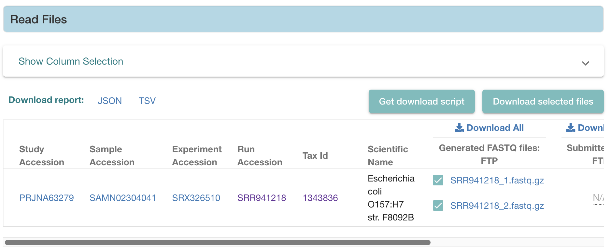

# quast-analysis

Questo progetto si concentra sull'analisi di **QUAST** (Quality Assessment Tool for Genome Assemblies), uno strumento ampiamente utilizzato per valutare la qualità degli assemblaggi genomici. L'obiettivo principale è capire come funziona QUAST, come valuta gli assemblaggi genomici e analizzare il codice per comprendere l'implementazione delle sue caratteristiche e metriche principali.

L'analisi ha incluso una revisione dettagliata del codice e l'applicazione di QUAST per valutare diversi strumenti di assemblaggio. Abbiamo esplorato come QUAST valuta i dati genomici, le metriche che utilizza e il ruolo dei genomi di riferimento nel suo processo di valutazione.

## Obiettivi principali

1. **Comprendere QUAST**:
   - Spiegare come QUAST funziona per valutare gli assemblaggi genomici.
   - Descrivere le diverse metriche e gli strumenti che QUAST utilizza per valutare la qualità degli assemblaggi.

2. **Analisi del codice**:
   - Esplorazione approfondita dei principali script di QUAST, in particolare lo script `quast.py`.
   - Analisi dettagliata di come QUAST elabora i dati genomici, inclusi come gestisce i contigs, i genomi di riferimento e i dati associati.

3. **Utilizzo del Galaxy Workflow**:
   - Sperimentare il funzionamento e le caratteristiche offerte dal Workflow di Galaxy.

## Struttura della repo
Nella sezione [`deliverables`](deliverables) sono presenti la [relazione](Deliverables/Analysis_MS_CC.pdf) del progetto e la [presentazione](Deliverables/PresentazioneQuastAnalysis_CC_MS.pdf).

Nella sezione [`files`](files), invece, sono presenti i necessari per riprodurre il caso d'uso relativo all'utilizzo del Galaxy Workflow, come presentato nella relazione. 

### Scaricare i file di sequenziamento
A causa della loro dimensione, i due file di sequenziamento, dati in input a Galaxy, non sono forniti direttamente in questa repo, tuttavia sono disponibili per il download [qui](https://www.ebi.ac.uk/ena/browser/view/SRR941218). Scendere in fondo alla pagina, selezionare i due file (come mostrato nella seguente figura) e cliccare `Download` o, in alternativa, cliccare su `Download All`.
.
